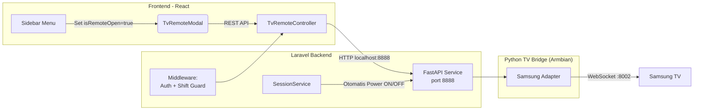

# Fitur Remot TV — Implementation Plan (v4 - Modal UI & Automation)

## Konteks

Aplikasi izireps-apps adalah sistem billing rental PlayStation. Data TV (IP, MAC, merk) tersimpan di tabel `devices`. Library yang digunakan di STB Armbian adalah **`samsung-tv-ws-api`**.

Berdasarkan diskusi, ada tiga keputusan penting:
1. **Otomatisasi Daya TV**: TV nyala otomatis saat sesi dimulai, mati otomatis saat sesi berakhir.
2. **Restriksi Remote Kasir**: Kasir hanya bisa mengatur volume/navigasi pada TV yang sedang ada sesi aktif (tidak bisa atur daya). Owner punya akses penuh.
3. **UI Remote Modal**: UI remote tidak berupa halaman utuh, melainkan sebuah **Modal** (popup) yang bisa dipanggil dari mana saja (misal: via Sidebar).

---

## Analisis UI: Modal vs Halaman Baru

Kamu bertanya tentang kekurangan menggunakan Modal. Berikut analisisnya:

### Kelebihan Modal (Sangat Disarankan untuk Remote):
*   **Quick Access (Akses Cepat)**: Kasir bisa membuka remote tanpa meninggalkan halaman yang sedang dikerjakan (misalnya sedang melihat daftar sesi atau transaksi).
*   **Konteks Terjaga**: Seperti memegang remote fisik, setelah selesai memencet tombol, kasir tinggal menutup modal dan langsung kembali bekerja.
*   **UX Lebih Natural**: Remote memang identik dengan alat kecil (widget/popup), bukan sesuatu yang harus mengambil seluruh layar monitor secara penuh.

### Kekurangan Modal (Tantangan Teknis):
1.  **Routing di Sidebar**: Sidebar menu saat ini menggunakan tag `<Link to="...">`. Untuk menu "Remot TV", kita harus mengubah perilakunya menjadi sebuah `<button>` yang memicu state modal (bukan pindah URL).
2.  **Responsivitas di Mobile**: Jika tombol remote terlalu banyak (D-pad, Numpad, Volume, dll), modal bisa terasa sesak di layar HP.
    *   *Solusi*: Kita akan buat modal ini bersifat responsif (menjadi `bottom-sheet` atau full-screen modal di layar HP, dan popup biasa di desktop).
3.  **State Management**: Kita perlu menyimpan state `isRemoteOpen` secara global (misalnya di Context atau Zustand) agar modal bisa dipanggil dari sidebar dan tetap terbuka meskipun route di belakang layar berubah.

**Kesimpulan:** Menggunakan Modal adalah ide yang **sangat bagus**. Kekurangannya sangat minor dan mudah ditangani secara teknis.

---

## Arsitektur Final

---

## 1. Otomatisasi Daya (Power ON / OFF)

Diinjeksi pada `SessionService.php`:
*   `startWalkIn()`, `startFromBooking()` → Trigger Power ON.
*   `checkout()`, `markTimeUp()` → Trigger Power OFF.

---

## 2. Restriksi Akses Kasir

Di `TvRemoteController.php`:
*   **Blokir POWER**: Jika role = cashier dan key = `KEY_POWER`, tolak request (403).
*   **Validasi Sesi Aktif**: Jika role = cashier, pastikan device target memiliki status `in_use`.

---

## 3. Komponen Python TV Bridge (Armbian)

Service Python ringan di `tv-bridge/` menggunakan FastAPI.
*   `POST /send-key`: Menggunakan WebSocket (`samsungtvws`).
*   `POST /power`:
    *   OFF: Kirim `KEY_POWER`.
    *   ON: Kirim Wake-on-LAN magic packet (karena TV mati tidak bisa di-ping via WebSocket).

---

## 4. Frontend React (Implementasi Modal)

1.  **Global State**: Buat Context sederhana atau tambah di Zustand store untuk mengelola `isTvRemoteModalOpen` dan `selectedTvId`.
2.  **Modifikasi Sidebar.jsx**: Ubah item menu "Remot TV" agar tidak menggunakan `<Link>`, melainkan memanggil aksi `openTvRemote()`.
3.  **Komponen `TvRemoteModal.jsx`**:
    *   Diletakkan di level Root (misal di `App.jsx` atau `Layout.jsx`) agar bisa muncul menutupi halaman apa saja.
    *   Berisi dropdown untuk memilih Device.
    *   Jika User = Kasir:
        *   Hanya menampilkan device yang statusnya `in_use`.
        *   Menyembunyikan tombol Power.
    *   Jika User = Owner:
        *   Menampilkan semua device.
        *   Menampilkan tombol Power.

---

## Urutan Implementasi

1. **Phase 1: Python TV Bridge**:
   * Setup FastAPI dan library `samsungtvws` + WoL logic.
2. **Phase 2: Laravel Backend**:
   * Buat `TvBridgeService.php`.
   * Integrasikan ke `SessionService.php` untuk ON/OFF otomatis.
   * Buat `TvRemoteController.php` dengan guard kasir.
3. **Phase 3: React Frontend**:
   * Buat Context/Store untuk modal.
   * Modifikasi Sidebar.
   * Buat komponen `TvRemoteModal.jsx`.

Apakah plan ini sudah solid dan boleh saya mulai eksekusi Phase 1 (Python TV Bridge)?
