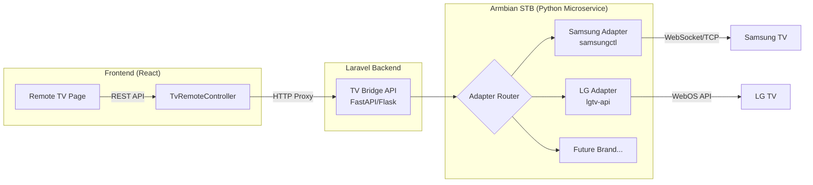
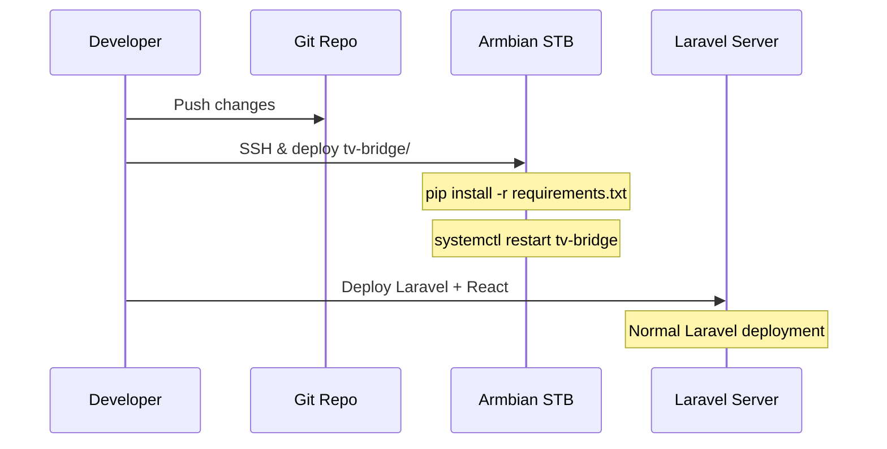

# Fitur Remot TV — Implementation Plan

## Konteks

Aplikasi izireps-apps adalah sistem billing rental PlayStation berbasis **React (frontend)** + **Laravel (backend)**. User ingin menambahkan fitur kontrol TV dari web app, dimana:

- **STB Armbian** sudah terkoneksi satu jaringan lokal dengan Smart TV Samsung
- Library `samsungctl` (Python) sudah terinstall di Armbian dan terbukti bisa kontrol TV via CLI
- Kedepannya harus bisa mendukung **multi-brand TV** (LG, Sony, dll) dengan library yang berbeda

---

## User Review Required

> [!IMPORTANT]
> **Arsitektur ini memerlukan Python microservice terpisah yang berjalan di STB Armbian.** Ini berarti ada service tambahan yang harus dideploy dan dimaintain selain Laravel backend. Apakah ini acceptable? Alternatifnya adalah Laravel langsung SSH ke Armbian, tapi ini lebih fragile dan lambat.

> [!WARNING]
> **Library `samsungctl` sudah cukup tua** (maintenance mode). Alternatif yang lebih modern:
> - [`samsung-tv-ws-api-python`](https://github.com/xchwarze/samsung-tv-ws-api) — lebih aktif, support websocket API
> - Atau tetap pakai `samsungctl` yang sudah proven di setup kamu
> 
> Mana yang kamu pakai saat ini?

## Open Questions

1. **Library apa yang sudah diinstall di Armbian?** (`samsungctl`, `samsung-tv-ws-api`, atau lainnya?)
2. **Apakah Armbian STB dan Laravel backend berjalan di mesin yang sama?** Atau beda mesin dalam satu LAN? Ini menentukan apakah kita perlu network call atau bisa local process.
3. **Siapa yang boleh akses remot TV?** Hanya cashier? Atau owner juga? (Saat ini menu sudah ada di sidebar cashier)
4. **Apakah perlu fitur discover TV otomatis?** Atau TV akan dikonfigurasi manual (IP + brand)?
5. **Berapa banyak TV yang akan dikontrol?** Satu per ruangan/device, atau satu TV shared?

---

## Arsitektur yang Direkomendasikan



### Kenapa Arsitektur Ini?

| Aspek | Keputusan | Alasan |
|---|---|---|
| **Python Microservice** | Service terpisah di Armbian | Library kontrol TV hampir semuanya Python-based. Menjalankan di Armbian = satu network segment dengan TV, latency minimal |
| **Adapter Pattern** | Interface tunggal, implementasi per-brand | Tambah brand baru = tambah file adapter baru, zero perubahan di core/frontend |
| **Laravel sebagai Proxy** | Backend meneruskan request ke Python service | Autentikasi & otorisasi tetap terpusat di Laravel. Frontend tidak perlu tahu IP Armbian |
| **REST API (bukan SSH)** | Python service expose HTTP endpoint | Jauh lebih reliable, testable, dan maintainable dibanding exec SSH command dari Laravel |

---

## Proposed Changes

### Komponen 1: Python TV Bridge Service (di Armbian STB)

> Service ringan yang berjalan di Armbian, expose REST API untuk kontrol TV.

#### [NEW] `tv-bridge/` (root-level directory baru)

Struktur folder:

```
tv-bridge/
├── main.py                  # FastAPI entry point
├── requirements.txt         # Dependencies
├── config.py                # Konfigurasi TV (IP, brand, dll)
├── adapters/
│   ├── __init__.py
│   ├── base.py              # Abstract base adapter (interface)
│   ├── samsung.py           # Samsung adapter (pakai samsungctl)
│   └── lg.py                # (placeholder untuk masa depan)
├── routes/
│   ├── __init__.py
│   └── remote.py            # Endpoint /send-key, /power, /volume, dll
├── tv_bridge.service        # Systemd unit file untuk auto-start
└── README.md                # Dokumentasi setup & deployment
```

**Key Design — `adapters/base.py`:**
```python
from abc import ABC, abstractmethod

class BaseTvAdapter(ABC):
    """Interface yang WAJIB diimplementasi setiap brand adapter."""
    
    @abstractmethod
    def power_on(self): ...
    
    @abstractmethod
    def power_off(self): ...
    
    @abstractmethod  
    def send_key(self, key: str): ...
    
    @abstractmethod
    def volume_up(self): ...
    
    @abstractmethod
    def volume_down(self): ...
    
    @abstractmethod
    def mute(self): ...
    
    @abstractmethod
    def channel_up(self): ...
    
    @abstractmethod
    def channel_down(self): ...
    
    @abstractmethod
    def get_status(self) -> dict: ...
```

**Key Design — `adapters/samsung.py`:**
```python
class SamsungAdapter(BaseTvAdapter):
    def __init__(self, host, port=8001, method="websocket"):
        self.config = {"host": host, "port": port, "method": method, ...}
    
    def send_key(self, key: str):
        # Gunakan samsungctl untuk kirim key
        with samsungctl.Remote(self.config) as remote:
            remote.control(key)
```

**Key Design — `routes/remote.py`:**
```python
@router.post("/send-key")
async def send_key(request: KeyRequest):
    adapter = get_adapter(request.tv_id)  # Factory method
    adapter.send_key(request.key)
    return {"status": "ok"}

@router.get("/tvs")
async def list_tvs():
    """List semua TV yang terdaftar beserta statusnya."""
    return [{"id": "tv-1", "brand": "samsung", "name": "TV Ruang 1", ...}]
```

---

### Komponen 2: Laravel Backend (Proxy + Auth)

#### [NEW] [TvRemoteController.php](file:///d:/bpf-2-react/izireps-apps/backend/app/Http/Controllers/Api/TvRemoteController.php)

Controller yang menjadi proxy antara frontend dan Python TV Bridge:

```php
class TvRemoteController extends Controller
{
    // GET  /tv/list           → proxy ke TV Bridge /tvs
    // POST /tv/send-key       → proxy ke TV Bridge /send-key
    // POST /tv/power          → proxy ke TV Bridge /power
    // POST /tv/volume         → proxy ke TV Bridge /volume
    // GET  /tv/{id}/status    → proxy ke TV Bridge /tvs/{id}/status
}
```

#### [MODIFY] [api.php](file:///d:/bpf-2-react/izireps-apps/backend/routes/api.php)

Tambah route group baru di section kasir (dan owner):

```php
// ── TV Remote ─────────────────────────────────────────────
Route::prefix('tv')->group(function () {
    Route::get('list', [TvRemoteController::class, 'list']);
    Route::post('send-key', [TvRemoteController::class, 'sendKey']);
    Route::post('power', [TvRemoteController::class, 'power']);
    Route::post('volume', [TvRemoteController::class, 'volume']);
    Route::get('{id}/status', [TvRemoteController::class, 'status']);
});
```

#### [MODIFY] [.env](file:///d:/bpf-2-react/izireps-apps/backend/.env)

Tambah konfigurasi TV Bridge:

```env
TV_BRIDGE_URL=http://192.168.x.x:8888
TV_BRIDGE_API_KEY=your-secret-key
```

#### [NEW] `config/tvbridge.php`

Config file Laravel untuk TV Bridge connection.

---

### Komponen 3: Frontend React

#### [NEW] `frontend/src/pages/CashierPages/TvRemote.jsx`

Halaman utama remote TV dengan UI yang menyerupai remote fisik:

- **TV Selector** — dropdown/tab untuk pilih TV mana yang dikontrol
- **Power Button** — tombol power on/off dengan status indicator
- **D-Pad** — navigasi atas/bawah/kiri/kanan + OK/Enter
- **Volume Control** — volume up/down + mute
- **Channel Control** — channel up/down
- **Number Pad** — tombol angka 0-9
- **Quick Actions** — Home, Back, Menu, Source/Input
- **Status Indicator** — online/offline badge

#### [NEW] `frontend/src/services/api.js` (tambah section)

```javascript
// ─── TV Remote ────────────────────────────────────────────────────────────────
export const tvRemoteApi = {
  listTvs: () => api.get("/tv/list"),
  sendKey: (tvId, key) => api.post("/tv/send-key", { tv_id: tvId, key }),
  power: (tvId, action) => api.post("/tv/power", { tv_id: tvId, action }),
  volume: (tvId, action) => api.post("/tv/volume", { tv_id: tvId, action }),
  status: (tvId) => api.get(`/tv/${tvId}/status`),
};
```

#### [MODIFY] [index.jsx](file:///d:/bpf-2-react/izireps-apps/frontend/src/router/index.jsx)

Tambah route `/cashier/remote` yang sudah ada di sidebar menu.

---

## Workflow Deployment



### Setup Armbian (One-time):
```bash
# 1. Copy tv-bridge/ ke Armbian
scp -r tv-bridge/ user@armbian:/opt/tv-bridge/

# 2. Install dependencies
cd /opt/tv-bridge && pip install -r requirements.txt

# 3. Setup systemd service
sudo cp tv_bridge.service /etc/systemd/system/
sudo systemctl enable tv-bridge
sudo systemctl start tv-bridge
```

---

## Verification Plan

### Automated Tests
1. **Python unit tests** — Test setiap adapter dengan mock (tanpa TV fisik)
2. **Laravel Feature tests** — Test proxy controller dengan mocked HTTP client
3. **Frontend** — Manual browser testing via remote page

### Manual Verification
1. Akses halaman `/cashier/remote` dari web browser
2. Pilih TV dari dropdown
3. Tekan tombol volume up → verifikasi TV merespons
4. Tekan tombol power → verifikasi TV mati/nyala
5. Test error handling: matikan TV Bridge service → pastikan UI menampilkan error yang jelas

---

## Keuntungan Arsitektur Ini

| ✅ Aspek | Detail |
|---|---|
| **Extensible** | Tambah brand baru = tambah 1 file adapter Python + register di config |
| **Maintainable** | Setiap layer terpisah jelas: Frontend → Laravel → Python → TV |
| **Secure** | Auth tetap di Laravel, Python service dilindungi API key |
| **Testable** | Setiap layer bisa ditest independen |
| **Deployable** | Python service = systemd unit, auto-restart. Laravel = deployment biasa |
| **Debuggable** | Setiap layer punya log sendiri, mudah trace error |
