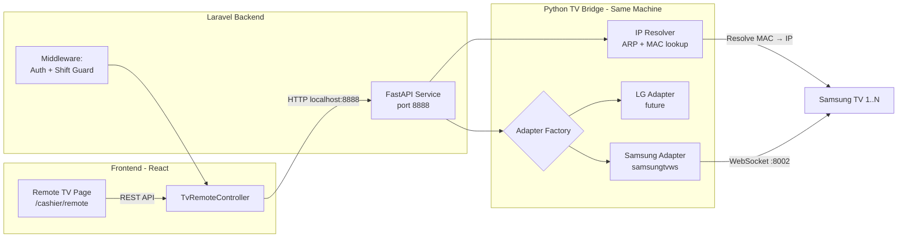
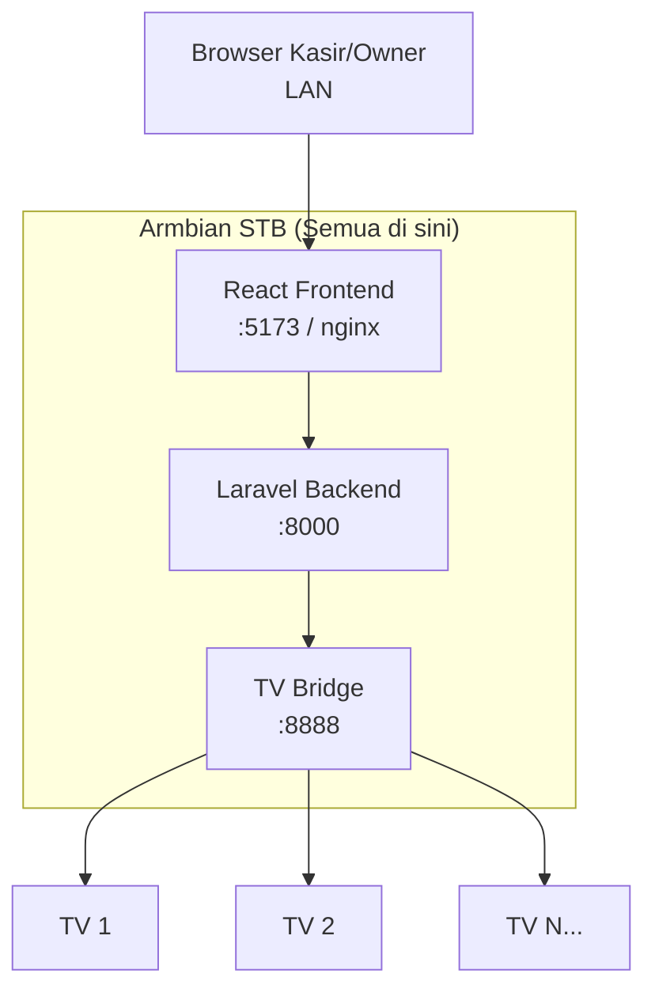
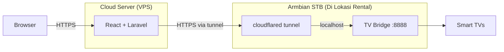
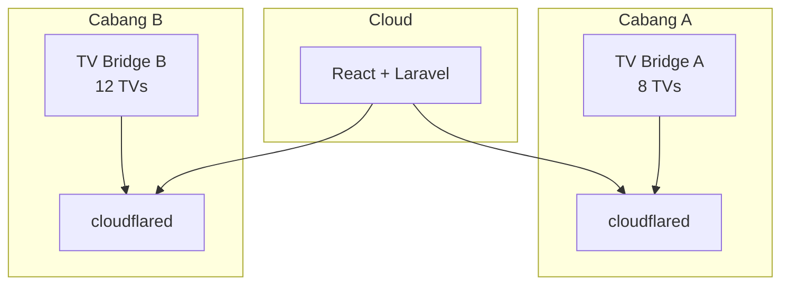
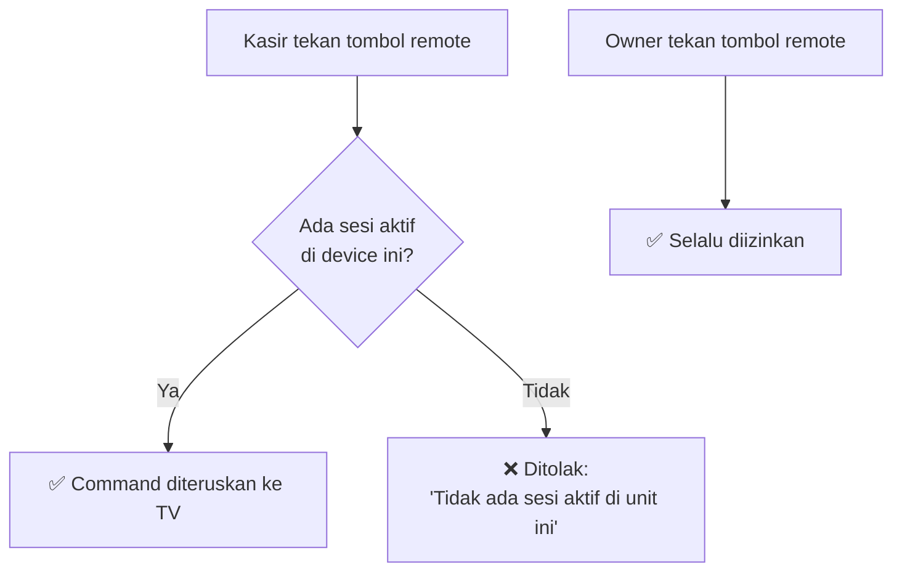
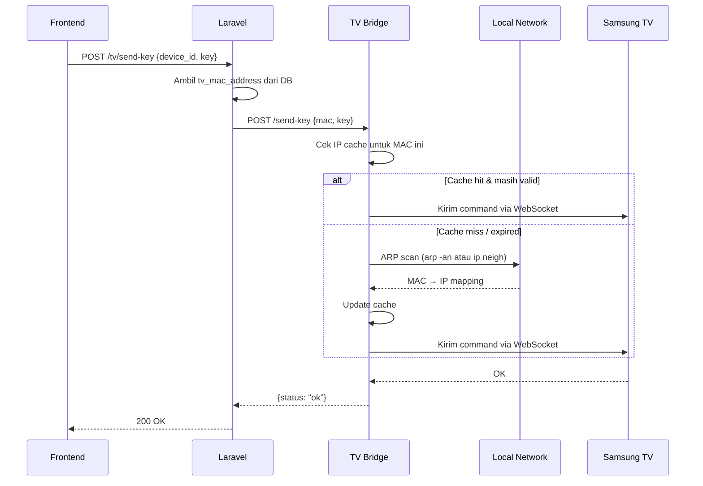

# Fitur Remot TV — Implementation Plan (v2 Refined)

## Konteks

Aplikasi izireps-apps adalah sistem billing rental PlayStation berbasis **React (frontend)** + **Laravel (backend)**, berjalan di **Armbian STB** yang satu jaringan lokal dengan Smart TV Samsung. Data TV (IP, MAC, merk) sudah tersimpan di tabel `devices` (kolom `tv`, `tv_ip_address`, `tv_mac_address`).

**Fakta kunci:**
- Library: **`samsung-tv-ws-api`** (`samsungtvws` di PyPI)
- Backend Laravel & TV Bridge saat ini di **mesin yang sama** (Armbian STB)
- TV menggunakan **DHCP** → IP bisa berubah, MAC address sebagai identifier stabil
- Jumlah TV: **8 unit** saat ini, target scalable hingga **50–100 unit**
- Akses: **Cashier + Owner**, dengan pembatasan agar cashier tidak menyalahgunakan

---

## Arsitektur Final



### Kenapa Arsitektur Ini Optimal?

| Keputusan | Alasan |
|---|---|
| **Python microservice terpisah** | Library TV control semuanya Python. Terpisah dari Laravel = isolasi dependency, crash satu tidak mengganggu yang lain |
| **Komunikasi via localhost** | Saat ini di mesin yang sama → zero latency. Jika nanti di-host terpisah, tinggal ganti URL |
| **MAC address sebagai primary identifier** | TV pakai DHCP → IP berubah. MAC tidak pernah berubah. IP di-resolve otomatis via ARP scan |
| **Adapter Pattern** | Tambah brand baru = tambah 1 file Python. Frontend & Laravel tidak berubah |
| **Audit logging** | Setiap command dicatat: siapa, kapan, TV mana, command apa |

---

## Strategi Deployment: Lokal vs Cloud

### Opsi 1: Full Lokal di Armbian (Recommended Saat Ini)



**Kelebihan:** Simpel, semua di satu mesin, latency minimal.
**Kekurangan:** Terbatas akses dari LAN saja.

---

### Opsi 2: Hybrid — Laravel di Cloud + TV Bridge di Armbian

Ketika project perlu diakses dari luar jaringan lokal (misal: owner ingin monitor dari rumah):



**Cara kerja:**
1. Install `cloudflared` di Armbian (gratis, dari Cloudflare)
2. Buat tunnel: `cloudflared tunnel create izireps-tvbridge`
3. Map subdomain: `tvbridge.yourdomain.com` → `localhost:8888`
4. Laravel di cloud call `https://tvbridge.yourdomain.com` instead of `localhost:8888`

**Kelebihan:** 
- Aman (outbound-only, tidak perlu buka port)
- Otomatis SSL
- Owner bisa kontrol TV dari mana saja

**Config di `.env` tinggal ganti:**
```env
# Lokal
TV_BRIDGE_URL=http://localhost:8888

# Cloud deployment
TV_BRIDGE_URL=https://tvbridge.yourdomain.com
```

> [!TIP]
> Alternatif selain Cloudflare Tunnel: **WireGuard VPN** (lebih teknis tapi lebih fleksibel), atau **Tailscale** (paling mudah setup).

---

### Opsi 3: Multi-Cabang — 1 Cloud Server, Banyak Armbian

Untuk rental dengan banyak cabang (50–100 TV):



> [!NOTE]
> Ini hanya referensi arsitektur. Untuk saat ini kita **fokus Opsi 1 (Full Lokal)** yang paling simpel dan sesuai kebutuhan.

---

## Akses Kontrol: Mencegah Penyalahgunaan Kasir

### Mekanisme: Session-Based Guard

Kasir hanya bisa mengontrol TV yang **terkait dengan device yang sedang memiliki sesi bermain aktif**. Owner bisa kontrol semua TV kapan saja.



**Implementasi di Laravel middleware/controller:**
```php
// Pseudo-code di TvRemoteController
public function sendKey(Request $request)
{
    $device = Device::findOrFail($request->device_id);
    $user = $request->user();
    
    // Owner bypass — selalu boleh
    if ($user->role !== 'owner') {
        // Cashier: cek apakah device punya sesi aktif
        $hasActiveSession = $device->sessions()
            ->whereNull('ended_at')
            ->exists();
            
        if (!$hasActiveSession) {
            return response()->json([
                'message' => 'Remote TV hanya bisa digunakan saat ada sesi bermain aktif di unit ini.'
            ], 403);
        }
    }
    
    // Forward ke TV Bridge...
}
```

**Kenapa ini efektif:**
- Kasir hanya bisa kontrol TV yang sedang dipakai pelanggan → **use case yang benar** (misal: ganti input HDMI, atur volume)
- Tidak bisa iseng kontrol TV yang tidak sedang dipakai
- Owner tetap punya full control untuk maintenance/setup
- Setiap command tetap di-log untuk audit trail

---

## Masalah DHCP & Solusi IP Resolution

Karena TV menggunakan DHCP, IP bisa berubah sewaktu-waktu. Solusi:

### Strategi: MAC-to-IP Resolution via ARP



**Implementasi IP Resolver (ringan, tanpa scapy):**
```python
import subprocess
import re

class IpResolver:
    """Resolve MAC address ke IP menggunakan ARP table OS."""
    
    def __init__(self, cache_ttl=300):  # cache 5 menit
        self._cache = {}  # {mac: (ip, timestamp)}
        self._ttl = cache_ttl
    
    def resolve(self, mac_address: str) -> str | None:
        # 1. Cek cache
        if cached := self._cache.get(mac_address.lower()):
            ip, ts = cached
            if time.time() - ts < self._ttl:
                return ip
        
        # 2. Baca ARP table dari OS (tanpa library tambahan)
        result = subprocess.run(['ip', 'neigh'], capture_output=True, text=True)
        for line in result.stdout.splitlines():
            if mac_address.lower() in line.lower():
                ip = line.split()[0]
                self._cache[mac_address.lower()] = (ip, time.time())
                return ip
        
        # 3. Fallback: ARP ping subnet untuk refresh tabel
        subprocess.run(['nmap', '-sn', '192.168.1.0/24'], 
                       capture_output=True, timeout=10)
        # Re-read...
        
        return None  # TV tidak ditemukan
```

> [!IMPORTANT]
> **Tidak perlu `scapy` atau library berat.** Cukup baca ARP table OS dengan `ip neigh` yang sudah ada di Armbian. Ringan dan tidak perlu root privilege tambahan.

---

## Scalability: 8 TV → 50–100 TV

### Analisis Performa

| Aspek | 8 TV | 50 TV | 100 TV |
|---|---|---|---|
| **Command latency** | ~50ms | ~50ms | ~50ms |
| **ARP scan time** | ~2s | ~5s | ~5s |
| **Memory per connection** | ~2MB | ~100MB | ~200MB |
| **Concurrent commands** | No issue | No issue | Use connection pool |

**FastAPI async + connection pooling** sudah cukup handle 100 TV:

```python
class ConnectionPool:
    """Manage persistent WebSocket connections ke TV."""
    
    def __init__(self, max_idle=60):
        self._connections = {}  # {mac: SamsungTVWS instance}
        self._last_used = {}
    
    def get_connection(self, mac, ip):
        if mac in self._connections:
            self._last_used[mac] = time.time()
            return self._connections[mac]
        
        tv = SamsungTVWS(ip, token_file=f"/opt/tv-bridge/tokens/{mac}.token")
        self._connections[mac] = tv
        self._last_used[mac] = time.time()
        return tv
    
    async def cleanup_idle(self):
        """Periodik tutup koneksi yang idle > max_idle detik."""
        ...
```

**Untuk skala besar (50+ TV), tambahan opsional:**
- **Bulk actions:** Endpoint `POST /bulk-send-key` untuk kirim command ke semua TV sekaligus (misal: matikan semua TV saat tutup)
- **Health check background task:** Ping semua TV setiap 60 detik, update status online/offline
- **Rate limiting:** Max 10 command/detik per TV untuk mencegah spam

---

## Proposed Changes (Detail)

### Komponen 1: Python TV Bridge Service

#### [NEW] `tv-bridge/` (root-level directory)

```
tv-bridge/
├── main.py                     # FastAPI entry point
├── requirements.txt            # samsungtvws, fastapi, uvicorn
├── config.py                   # Settings (port, API key, subnet)
├── adapters/
│   ├── __init__.py
│   ├── base.py                 # Abstract base adapter interface
│   ├── samsung.py              # Samsung adapter (samsungtvws)
│   └── factory.py              # Adapter factory — pilih adapter by brand
├── services/
│   ├── __init__.py
│   ├── ip_resolver.py          # MAC → IP resolution via ARP
│   └── connection_pool.py      # Persistent connection management
├── routes/
│   ├── __init__.py
│   └── remote.py               # API endpoints
├── tv_bridge.service           # Systemd unit file
└── README.md                   # Setup & deployment docs
```

**`requirements.txt`:**
```
fastapi==0.115.*
uvicorn[standard]==0.34.*
samsungtvws[async]==2.7.*
python-dotenv==1.1.*
```

**Key endpoints:**
| Method | Path | Deskripsi |
|---|---|---|
| `POST` | `/send-key` | Kirim key command ke TV |
| `POST` | `/power` | Power on (WoL) / off |
| `POST` | `/bulk-action` | Kirim command ke banyak TV sekaligus |
| `GET` | `/status/{mac}` | Cek status online/offline TV |
| `GET` | `/health` | Health check TV Bridge service |

---

### Komponen 2: Laravel Backend

#### [NEW] `app/Http/Controllers/Api/TvRemoteController.php`

```php
class TvRemoteController extends Controller
{
    public function sendKey(Request $request)    // POST /tv/send-key
    public function power(Request $request)      // POST /tv/power  
    public function bulkAction(Request $request) // POST /tv/bulk-action (owner only)
    public function status($deviceId)            // GET  /tv/{device}/status
}
```

#### [NEW] `app/Services/TvBridgeService.php`

Service class untuk HTTP communication ke Python TV Bridge. Menggunakan Laravel HTTP Client (`Http::post()`).

```php
class TvBridgeService 
{
    public function sendKey(string $mac, string $brand, string $key): array
    public function power(string $mac, string $brand, string $action): array
    public function getStatus(string $mac): array
    public function bulkSendKey(array $tvs, string $key): array
}
```

#### [NEW] `app/Http/Middleware/TvSessionGuard.php`

Middleware yang memastikan kasir hanya bisa kontrol TV dengan sesi aktif.

#### [MODIFY] `routes/api.php`

Tambah route group di section kasir+owner:

```php
// ── TV Remote ─────────────────────────────────────────────
Route::prefix('tv')->group(function () {
    Route::post('send-key', [TvRemoteController::class, 'sendKey']);
    Route::post('power', [TvRemoteController::class, 'power']);
    Route::get('{device}/status', [TvRemoteController::class, 'status']);
});
```

Dan di section owner-only:
```php
Route::post('tv/bulk-action', [TvRemoteController::class, 'bulkAction']);
```

#### [MODIFY] `.env` / [NEW] `config/tvbridge.php`

```env
TV_BRIDGE_URL=http://localhost:8888
TV_BRIDGE_API_KEY=random-secret-key-here
```

#### [NEW] Migration: `create_tv_command_logs_table`

Audit trail untuk semua command yang dikirim:

```php
Schema::create('tv_command_logs', function (Blueprint $table) {
    $table->id();
    $table->foreignId('device_id')->constrained('devices');
    $table->foreignId('user_id')->constrained('users');
    $table->string('command');       // KEY_VOLUP, KEY_POWER, dll
    $table->string('status');        // success, failed, timeout
    $table->string('error')->nullable();
    $table->timestamp('created_at');
});
```

---

### Komponen 3: Frontend React

#### [NEW] `pages/CashierPages/TvRemote.jsx`

Halaman remote TV dengan UI mirip remote fisik:

| Section | Elemen |
|---|---|
| **TV Selector** | Grid/dropdown pilih device (tampilkan nama + status TV online/offline) |
| **Power** | Tombol power dengan indicator hijau/merah |
| **D-Pad** | Navigasi ↑↓←→ + OK (center) |
| **Volume** | Vol+ / Vol- / Mute (layout vertikal di sisi kiri) |
| **Channel** | Ch+ / Ch- (layout vertikal di sisi kanan) |
| **Number Pad** | Tombol 0-9 (grid 3×4) |
| **Quick Actions** | Home, Back, Menu, Source/Input, Guide |
| **Status Bar** | TV name, online status, last command |

#### [MODIFY] `services/api.js`

Tambah section TV Remote API:

```javascript
export const tvRemoteApi = {
  sendKey: (deviceId, key) => api.post("/tv/send-key", { device_id: deviceId, key }),
  power: (deviceId, action) => api.post("/tv/power", { device_id: deviceId, action }),
  status: (deviceId) => api.get(`/tv/${deviceId}/status`),
  bulkAction: (deviceIds, key) => api.post("/tv/bulk-action", { device_ids: deviceIds, key }),
};
```

#### [MODIFY] `router/index.jsx`

Tambah route:
```jsx
{ path: "remote", element: <S><CashierTvRemote /></S> },
```

---

## Verification Plan

### Automated Tests
1. **Python:** Unit test adapter dengan mock WebSocket (tanpa TV fisik)
2. **Laravel:** Feature test `TvRemoteController` dengan mocked `TvBridgeService`
3. **Integration:** Test end-to-end dari frontend → Laravel → TV Bridge (dengan mock adapter)

### Manual Verification
1. Buka `/cashier/remote` → pilih device → tekan Volume Up → TV merespons
2. Test guard: Tanpa sesi aktif → tombol tidak bisa dipakai (cashier)
3. Test owner: Owner bisa kontrol semua TV tanpa sesi aktif
4. Test ARP resolution: Restart TV (IP berubah DHCP) → remote masih bisa connect
5. Test power on via Wake-on-LAN → TV menyala dari kondisi off

---

## Urutan Implementasi

| Phase | Scope | Estimasi |
|---|---|---|
| **Phase 1** | Python TV Bridge: adapter Samsung + FastAPI endpoints | Core service |
| **Phase 2** | Laravel: Controller, Service, Middleware, Routes, Migration | Backend proxy |
| **Phase 3** | React: TvRemote.jsx page + API integration + Router | Frontend UI |
| **Phase 4** | Testing end-to-end + systemd service setup | Verification |
| **Phase 5** *(opsional)* | Bulk actions, connection pool, health monitoring | Scale optimization |
