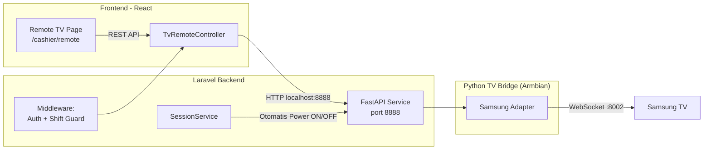

# Fitur Remot TV — Implementation Plan (v3 - Automation & Role Restrictions)

## Konteks

Aplikasi izireps-apps adalah sistem billing rental PlayStation. Data TV (IP, MAC, merk) tersimpan di tabel `devices`. Library yang digunakan di STB Armbian adalah **`samsung-tv-ws-api`**.

Berdasarkan feedback terbaru, ada dua kebutuhan utama terkait flow operasional:
1. **Otomatisasi Daya TV**: TV harus menyala otomatis saat sesi dimulai (oleh kasir), dan mati otomatis saat sesi berakhir atau waktu habis.
2. **Restriksi Remote Kasir**: Kasir yang sedang bertugas hanya boleh menggunakan kontrol dasar (Volume, D-Pad, dll), **TIDAK** boleh mengatur daya (Power) secara manual. Kasir di luar shift (tidak bertugas) tidak bisa menggunakan fitur ini. Owner memiliki akses penuh.

---

## Arsitektur Final



---

## 1. Otomatisasi Daya (Power ON / OFF)

Kita akan menyisipkan HTTP call ke TV Bridge langsung dari `SessionService.php` agar daya TV sinkron dengan status sesi.

*   **Sesi Dimulai (Power ON)**:
    *   Di `startWalkIn()`
    *   Di `startFromBooking()` (Saat pelanggan tiba dan kasir klik mulai)
*   **Sesi Berakhir (Power OFF)**:
    *   Di `checkout()` (Jika diakhiri manual oleh kasir)
    *   Di `markTimeUp()` (Jika waktu habis otomatis dari scheduler)

**Contoh Injeksi di `SessionService.php`:**
```php
// Di dalam startFromBooking atau startWalkIn:
app(TvBridgeService::class)->power($device->tv_mac_address, 'samsung', 'ON');

// Di dalam checkout atau markTimeUp:
app(TvBridgeService::class)->power($device->tv_mac_address, 'samsung', 'OFF');
```

---

## 2. Restriksi Akses Kasir (Mencegah Penyalahgunaan)

### Aturan Bisnis:
1. **Otorisasi Command**: Kasir dilarang mengirim command `KEY_POWER` atau mematikan/menyalakan TV dari halaman Remote. Hanya Owner yang boleh.
2. **Validasi Sesi Aktif**: Kasir hanya bisa meremote TV pada device yang status sesinya sedang **Aktif** (`in_use`). Jika device kosong, kasir tidak bisa meremote TV tersebut.
3. **Validasi Shift**: (Karena tidak ada tabel `Shift` eksplisit, kita asumsikan jika login, dia berpotensi bertugas. Namun guard #2 di atas sudah sangat membatasi bahwa dia hanya bisa kontrol TV yang ada pelanggannya).

### Implementasi di `TvRemoteController.php`:

```php
public function sendKey(Request $request)
{
    $device = Device::findOrFail($request->device_id);
    $user = $request->user();
    
    // Jika user adalah Kasir, lakukan validasi ketat
    if ($user->role === 'cashier') {
        
        // 1. Blokir command POWER
        if (in_array($request->key, ['KEY_POWER', 'KEY_POWEROFF'])) {
            return response()->json(['message' => 'Kasir tidak diizinkan mengubah daya TV secara manual.'], 403);
        }

        // 2. Pastikan device ini sedang digunakan (ada sesi aktif)
        if (!$device->isAvailable() && $device->status !== \App\Enums\DeviceStatus::InUse) {
            // Atau bisa cek lewat relasi sessions()->where('status', SessionStatus::Active)
             return response()->json(['message' => 'Remote TV hanya bisa digunakan saat ada sesi aktif.'], 403);
        }
    }
    
    // Lolos validasi (Owner selalu lolos), teruskan ke TV Bridge
    $response = app(TvBridgeService::class)->sendKey($device->tv_mac_address, 'samsung', $request->key);
    
    // ... log command ...
}
```

---

## 3. Komponen Python TV Bridge (Armbian)

Service Python yang ringan akan dibuat di `tv-bridge/` menggunakan FastAPI.

**Endpoints:**
*   `POST /send-key`: Menerima `{ mac, key }`. Resolve MAC ke IP via tabel ARP OS lokal, lalu kirim command via WebSocket library `samsungtvws`.
*   `POST /power`: Menerima `{ mac, action: "ON"|"OFF" }`.
    *   **Power OFF**: Kirim `KEY_POWER` via WebSocket.
    *   **Power ON**: Karena TV yang mati tidak bisa merespons WebSocket, kita gunakan **Wake-on-LAN (WoL)** dengan magic packet ke MAC address TV. `samsungtvws` juga memiliki fitur WoL bawaan.

---

## 4. Frontend React

*   Buat `frontend/src/pages/CashierPages/TvRemote.jsx`.
*   Tampilkan grid/list Device.
*   Jika User = Kasir, dan Device status = Kosong, **disable** tombol remote untuk device tersebut.
*   Jika User = Kasir, **sembunyikan atau disable** tombol Power. Tombol power hanya muncul/bisa diklik jika User = Owner.
*   Fungsi remote dasar: Volume, Mute, Arah (D-pad), Enter, Home, Back.

---

## Urutan Implementasi

1. **Python TV Bridge**:
   * Setup FastAPI dan library `samsungtvws` + WoL logic.
2. **Laravel Backend (API & Otomatisasi)**:
   * Buat `TvBridgeService.php`.
   * Integrasikan ke `SessionService.php` untuk ON/OFF otomatis.
   * Buat `TvRemoteController.php` dengan guard kasir.
3. **React Frontend**:
   * Buat UI halaman Remote.
   * Integrasi dengan API backend.
   * Logic disable tombol Power & disable remote jika device kosong.

Apakah alur logika otomatisasi daya dan restriksi kasir ini sudah sesuai dengan yang kamu harapkan? Jika iya, saya akan mulai mengeksekusi Phase 1 (Membuat Python TV Bridge).
